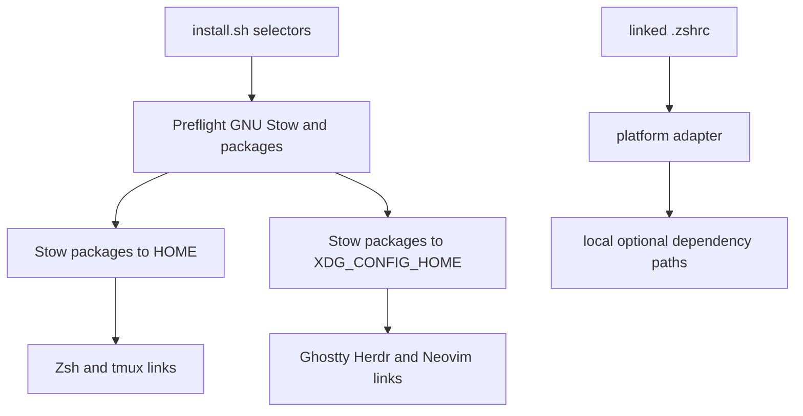

# GNU Stow Dotfile Deployment Design

**Spec**: `.specs/features/stow-migration/spec.md`
**Status**: Approved

## Architecture Overview

The repository becomes a GNU Stow directory whose child directories are packages. `install.sh`
parses selectors, validates the local prerequisite and package roots, then invokes Stow with an
explicit directory and target. Stow owns symlink creation, tree folding, idempotency, and conflict
detection. The wrapper creates the XDG target parent only for a real deployment.

### Approaches considered

1. **GNU Stow wrapper with one package per group, recommended and selected.** It preserves the
   existing selector contract, makes ownership visible through symlinks, and lets GNU Stow handle
   conflicts without duplicating its tree algorithm.
2. **Keep copy deployment and add more backup logic.** This retains existing implementation cost
   but preserves whole-tree replacement and hidden ownership, so it does not solve the stated
   problem.
3. **Use a single home snapshot package.** This simplifies one command but loses selective group
   deployment and conflates `$HOME` with `XDG_CONFIG_HOME` ownership.

## Code Reuse Analysis

### Existing Components to Leverage

| Component | Location | How to use |
| --- | --- | --- |
| Selector names and exit-code contract | `install.sh` | Preserve flags, additive selection, help status `0`, invalid invocation status `2`, and no-argument all-groups behavior. |
| Configuration source trees | `.tmux/`, `ghostty/`, `herdr/`, `nvim/` | Move into package installation images without changing their internal application paths. |
| Shared Zsh aliases and environment | `terminal/.zshrc` | Move into `packages/zsh/dot-zshrc` and split machine-specific dependency loading. |
| Shell integration harness | `tests/install_test.sh` | Retain dependency-free temporary fixtures and extend assertions to symlink ownership and Zsh startup. |

## Components

### Stow package images

- **Purpose**: Store each application's repository-managed installation image under one stable package root.
- **Location**: `packages/`
- **Interfaces**: GNU Stow package names `zsh`, `tmux`, `ghostty`, `herdr`, and `nvim`.
- **Dependencies**: GNU Stow at deployment time.
- **Reuses**: Existing configuration file contents and plugin assets.

The `--dotfiles` option maps `dot-zshrc`, `dot-p10k.zsh`, `dot-tmux.conf`, and `dot-tmux/` to
`.zshrc`, `.p10k.zsh`, `.tmux.conf`, and `.tmux/` in the target. The other packages preserve their
application directory names so a target switch changes only the config root.

### Deployment wrapper

- **Purpose**: Parse the repository's selector interface and invoke Stow with the correct target.
- **Location**: `install.sh`
- **Interfaces**: `install.sh [--simulate] [--zsh] [--tmux] [--ghostty] [--herdr] [--nvim]`.
- **Dependencies**: POSIX shell utilities and GNU Stow; no package manager or network client.
- **Reuses**: Existing selector parsing and repository-root resolution.

Home-target packages are passed to Stow with `$HOME` as `--target`. Configuration-target packages
are passed with `${XDG_CONFIG_HOME:-$HOME/.config}` as `--target`. The wrapper never passes
`--adopt` and never creates a backup directory.

### Zsh runtime adapters

- **Purpose**: Keep shared aliases and environment portable while resolving optional dependency paths per platform.
- **Location**: `packages/zsh/dot-zshrc` and `packages/zsh/dot-zshrc.d/`
- **Interfaces**: The linked `.zshrc` selects `macos.zsh` or `linux.zsh` using `uname`, with
  `MYDOTFILES_ZSH_PLATFORM` available to deterministic probes.
- **Dependencies**: Zsh and any locally installed optional tools.
- **Reuses**: Existing aliases, PATH entries, NVM variables, Powerlevel10k instant prompt, and p10k loading behavior.

The macOS adapter searches `HOMEBREW_PREFIX`, `/opt/homebrew`, and `/usr/local` for Powerlevel10k,
zsh-autosuggestions, and zsh-completions. It runs `compinit -i` after adding the completion source.
The Linux adapter checks only user-local optional paths and does not inspect Homebrew prefixes.

### Integration test fixture

- **Purpose**: Exercise the wrapper and shell startup without modifying the real home directory or requiring a package manager.
- **Location**: `tests/install_test.sh` and `tests/zsh_test.sh`
- **Interfaces**: `sh tests/install_test.sh` is the repository-level gate; its fixture Stow command
  models link, simulation, idempotency, and conflict outcomes for wrapper coverage.
- **Dependencies**: POSIX shell, GNU-compatible filesystem utilities, and Zsh for runtime probes.
- **Reuses**: Existing temporary HOME/XDG/STATE isolation and assertion helpers.

## Error Handling Strategy

| Error scenario | Handling | User impact |
| --- | --- | --- |
| GNU Stow missing | Preflight `command -v stow`, report prerequisite, exit non-zero | No target is changed. |
| Package root missing | Preflight selected package directory, report source, exit non-zero | No selected target is changed. |
| Existing user-owned target | Let Stow report a conflict without `--adopt` | Existing content remains intact. |
| Invalid selector | Parse before preflight, print usage, exit `2` | No target or state path is created. |
| Simulation | Pass `--simulate` and `--verbose` to Stow, skip target-parent creation | Planned operations are visible without filesystem changes. |

## Risks & Concerns

| Concern | Location | Impact | Mitigation |
| --- | --- | --- | --- |
| Existing installer backs up and replaces whole trees | `install.sh` | Keeping any of that flow would undermine Stow ownership and safety. | Replace it with a thin preflight and delegation wrapper; conflict tests assert preservation. |
| Current Zsh assumes optional paths directly | `terminal/.zshrc:1` | A missing path can emit startup errors or skip prompt setup. | Move optional path checks into explicit macOS/Linux adapters and test both absent and present fixtures. |
| GNU Stow is not installed in the current test environment | deployment prerequisite | Real deployment cannot be manually smoke-tested here. | Test the wrapper with an isolated Stow fixture, add a missing-prerequisite test, and document GNU Stow as required for actual deployment. |
| `github/github-recovery-codes.txt` is tracked | `github/github-recovery-codes.txt` | Credential exposure remains a separate security issue. | Keep it out of package layout and scope; call out separate rotation/history work. |

## Tech Decisions

| Decision | Choice | Rationale |
| --- | --- | --- |
| Dotfile naming | Use GNU Stow `--dotfiles` with `dot-` package names | It preserves readable package contents while producing conventional hidden target names. |
| Target grouping | Invoke Stow once for selected home packages and once for selected config packages | It keeps `$HOME` and XDG configuration ownership separate while preserving additive selectors. |
| Existing files | Do not pass `--adopt` or add a wrapper backup mechanism | GNU Stow's conflict behavior is explicit and avoids silently importing local edits. |
| Simulation | Add `--simulate` to the wrapper and pass Stow `--simulate --verbose` | The documented preview follows the same selector path as real deployment. |
